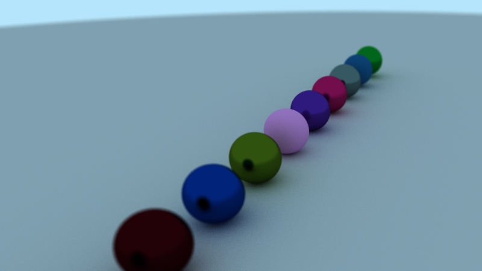

# ray-tracing

Go implementation of a basic Ray Tracing renderer, based on ['Ray Tracing in One Weekend'](https://raytracing.github.io/).

## Screenshots

  
  <em>Diffuse, metal and glass spheres</em>

  
  <em>Reflection</em>

  
  <em>Focal blur</em>

